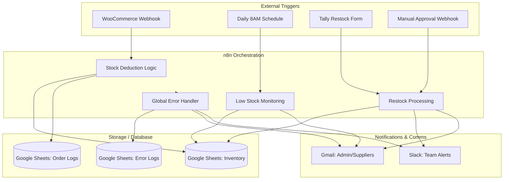

# System Architecture: WooCommerce Inventory Management Automation

This document outlines the technical architecture and data flow of the n8n-based inventory management system.

## 1. High-Level Architecture

The system acts as a middleware between **WooCommerce** (e-commerce platform) and **Google Sheets** (inventory database), using **n8n** for orchestration and logic.

## 2. Component Breakdown

### A. Order Processing & Stock Deduction
- **Trigger:** Webhook from WooCommerce when an order status changes to `processing`.
- **Logic:** Extracts line items, matches SKUs against the Google Sheet, calculates new stock levels (`Current - Ordered`), and updates the sheet.
- **Output:** Updates "Inventory" sheet and appends to "Orders log".

### B. Inventory Monitoring & Restocking
- **Trigger:** Scheduled CRON trigger (Daily 8:00 AM).
- **Categorization:** Items are split into `Auto-Order` (direct supplier email) or `Manual-Approval` (links in the daily report).
- **Communication:** Sends HTML reports to the admin and Purchase Orders to suppliers.

### C. Restock Confirmation (Tally Integration)
- **Trigger:** Webhook from Tally.so form.
- **Logic:** Parses incoming stock data, calculates `Old Stock + Received`, and updates the "Inventory" sheet.
- **Feedback:** Sends confirmation via Slack and Gmail.

### D. Global Error Handler
- **Trigger:** Error Trigger node linked to all workflows.
- **Logic:** Identifies the failed node, assigns severity (CRITICAL vs WARNING), and captures stack traces.
- **Action:** Centralized logging in "Error Logs" sheet and immediate alerts via Slack/Email.

## 3. Data Schema (Google Sheets)

### Inventory Sheet
| Column | Description |
| :--- | :--- |
| SKU | Unique product identifier (Primary Key) |
| Product Name | Display name |
| Current Stock | Numerical stock count |
| Reorder Threshold | Trigger point for low stock |
| Reorder Qty | Standard amount to order |
| Supplier Email | Destination for POs |
| Auto Ordering Allowed | Boolean (Yes/No) |
| Last Updated | ISO Timestamp |

### Error Logs
| Column | Description |
| :--- | :--- |
| Timestamp | When the error occurred |
| Severity | CRITICAL or WARNING |
| Workflow | Name of the failed workflow |
| Failed Node | Node that threw the error |
| Error Message | Description of the failure |
| Execution ID | Link to n8n execution |
